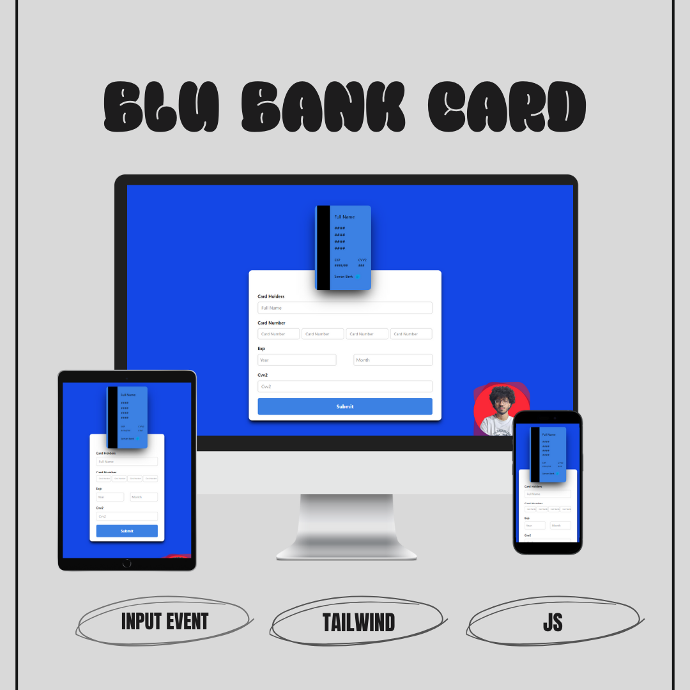
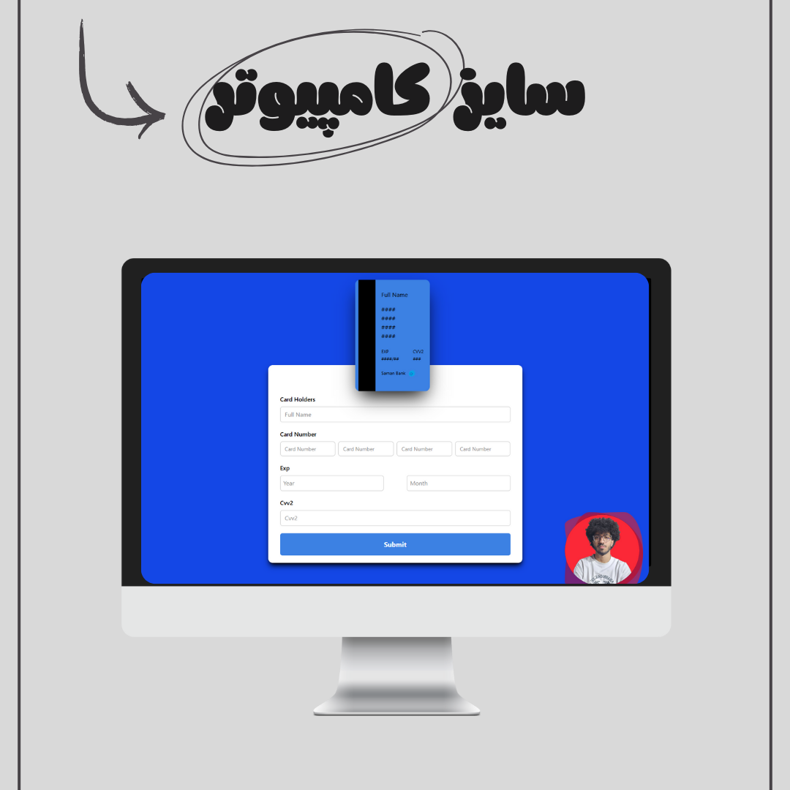
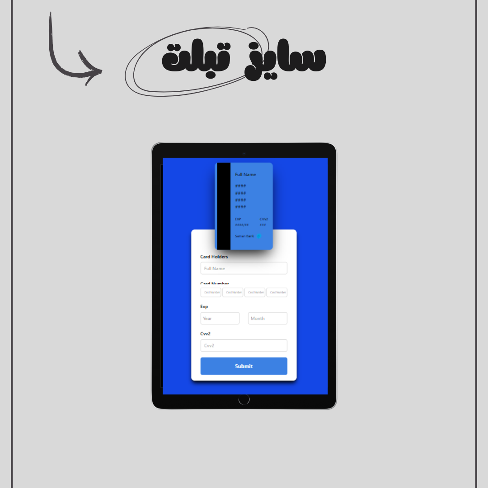
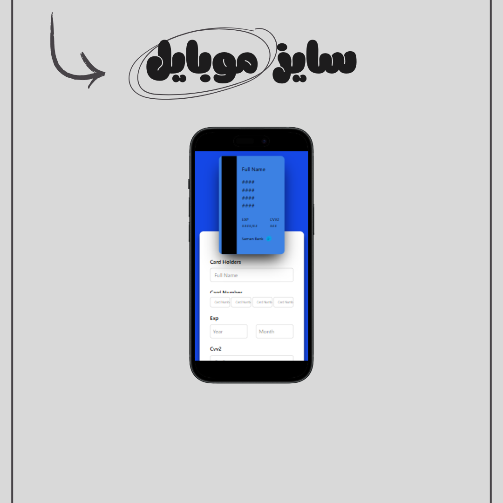

# 💳 Live Bank Card UI – Interactive Card Form

A responsive and interactive **bank card UI** built with **HTML5, Tailwind CSS, and Vanilla JavaScript**.  
The form updates the visual card in real-time using `input` events: cardholder name, card number, expiry month/year, and CVV2 are reflected on the card as you type. Sensitive parts of the card number and CVV are masked with `*` for security. When the CVV input is focused, the card flips to show the back.

این یک رابط کاربری کارت بانکی تعاملی است که با HTML5، Tailwind CSS و JavaScript ساخته شده است. اطلاعات کارت (نام، شماره کارت، تاریخ انقضا، CVV2) به صورت زنده روی کارت نمایش داده می‌شوند. بخشی از شماره کارت و CVV برای امنیت با `*` ماسک می‌شود و هنگام فوکوس روی CVV کارت پشت نمایش داده می‌شود.

---

## 📅 Project Date | تاریخ ساخت  
**September 28, 2025 | ۷ مهر ۱۴۰۴**

---

## 🔗 Live Demo  
[👉 View Live Demo](https://parsa-farshah.github.io/blu/)

---

## ✨ Key Features | ویژگی‌ها  

- ✅ **Real-time updates** – all fields update the card UI instantly  
- 🔐 **Security masking** – sensitive digits hidden with `*`  
- 🔁 **Card flip** – CVV focus flips the card to the back  
- 📱 **Fully Responsive** – works smoothly on desktop, tablet, and mobile  
- 🎨 **Modern UI/UX** – clean design using Tailwind CSS  

---

## 🛠️ Tech Stack | تکنولوژی‌ها  

- **HTML5** – semantic structure  
- **Tailwind CSS** – responsive styling  
- **Vanilla JavaScript** – dynamic updates and interactivity  

---

## 👨‍💻 Developed By | توسعه‌دهنده  
**Parsa Dehghan Pour Farashah**

## 🔧 Project Mentor | مربی پروژه  
[@parsa_ghorbanian_web](https://www.instagram.com/parsa_ghorbanian_web)

---

## 📲 Connect with Me | ارتباط با من  

- 📸 Instagram: [@parsa_dehghanpour_dv](https://www.instagram.com/parsa_dehghanpour_dv?igsh=eHkwNWhsa3I4ZWVp)  
- 💼 LinkedIn: [linkedin.com/in/parsa-dehghan-pour-farashah-85ab04250](http://linkedin.com/in/parsa-dehghan-pour-farashah-85ab04250)  
- 💻 GitHub: [parsa-farshah](http://github.com/parsa-farshah)  
- 📩 Email: parsafarashah2002@gmail.com  
- 📺 YouTube: [@FrontEndFresh](https://youtube.com/@frontendfresh?si=-2WsIYe-KBTUfwyu)

---

## 📸 Screenshots | پیش‌نمایش پروژه  

### 🌟 Overview  

### 💻 Desktop View  

### 📱 Tablet View  

### 📱 Mobile View  

